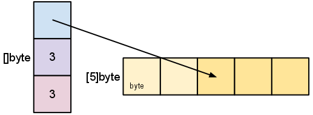

============================================
Go Slices: usage and internals
============================================

Goのslice型は型付けされたデータの配列を操作する便利で効率的な方法を提供します。スライスは他の言語でいうところの配列に似ていますが、いくつかの特徴があります。本記事ではスライスの概要と使用方法を説明します。

配列
============================================

slice型はGoの配列型の上に構築されている抽象化であるため、スライスを理解するためには、まず配列を理解する必要があります。

配列型の定義は、配列の長さと要素の型を指定します。例えば、型 ``[4]int`` は4つの整数を格納する配列を表します。配列のサイズは固定されています。その長さはその型の一部です( ``[4]int`` と ``[5]int`` は別の型です)。配列には通常の方法でインデックスを付けることができるため、式 ``s[n]`` は0から始まる *n* 番目の要素にアクセスします。

.. code-block:: go

   var a [4]int
   a[0] = 1
   i := a[0]
   // i == 1

配列は明示的に初期化をする必要がありません。配列のゼロ値は、要素自体がゼロ値で初期化されているすぐに使用できる配列です。

.. code-block:: go

   // a[2] == 0, the zero value of the int type

``[4]int`` のメモリ上での表現は、連続して配置された4つの整数値です。

.. image:: images/go-slices-usage-and-internals_slice-array.png

Goの配列は値です。配列の変数は、配列全体を示します。(Cの場合のように)配列の最初の要素へのポインタではありません。これは、配列の値を割り当てたり、関数に渡したりすると、その内容のコピーが作成されることを意味します。(コピーを回避するために、配列への *ポインタ* を渡すことができますが、それは配列ではなく配列へのポインタです。)配列について考える1つの方法は、固定サイズの複合値のような名前付きフィールドではなく、インデックス付きフィールドのような構造です。

配列のリテラルは次のように指定できます。

.. code-block:: go

   b := [2]string{"Penn", "Teller"}

または、コンパイラに配列の要素をカウントさせることができます。

.. code-block:: go

   b := [...]string{"Penn", "Teller"}

いずれの場合も ``b`` の型は ``[2]string`` です。

スライス
============================================

配列はGoに含まれていますが、少し柔軟性に欠けるため、Goのコードではあまり頻繁に表れません。ただし、スライスはよく見かけます。配列上に構築され、優れた力と利便性を提供します。

スライスの型指定は ``[]T`` です。``T`` はスライスの要素の型です。配列型とは異なり、スライス型には長さが指定されていません。

スライスのリテラルは、要素の数を省略したことを除いて、配列のリテラルと同様に宣言されます。

.. code-block:: go

   letters := []string{"a", "b", "c", "d"}

スライスは ``make`` という組み込み関数を使用して作成できます。これには以下のようなシグネチャがあります。

.. code-block:: go

   func make([]T, len, cap) []T

Tは、作成するスライスの要素の型です。``make`` 関数は、型、長さ、およびオプションの容量を取ります。呼び出されると、``make`` は配列を割り当て、その配列を参照するスライスを返します。

.. code-block:: go

   var s []byte
   s = make([]byte, 5, 5)
   // s == []byte{0, 0, 0, 0, 0}

容量の引数を省略すると、デフォルトで長さの引数と同じになります。上記と同じコードでより簡潔なバージョンを次に示します。

.. code-block:: go

   s := make([]byte, 5)

組み込みの ``len`` および ``cap`` 関数を使用して、スライスの長さと容量を調べることができます。

.. code-block:: go

   len(s) == 5
   cap(s) == 5

次の2つのセクションでは、長さと容量の関係について説明します。

スライスのゼロ値は ``nil`` です。``len`` や ``cap`` 関数はnilスライスとして0を返します。

スライスは、既存のスライスまたは配列を「スライス」することでも作ることができます。スライスは、コロンで区切られた2つのインデックスで半開区間を指定することによって作成されます。例えば、``b[1：4]`` は、``b`` の1から3のインデックスの要素を含むスライスを作成します(結果のスライスのインデックスは0～2になります)。

.. code-block:: go

   b := []byte{'g', 'o', 'l', 'a', 'n', 'g'}
   // b[1:4] == []byte{'o', 'l', 'a'}, sharing the same storage as b

スライス式の開始インデックスと終了インデックスはオプションです。デフォルトはそれぞれゼロとスライスの長さです。

.. code-block:: go

   // b[:2] == []byte{'g', 'o'}
   // b[2:] == []byte{'l', 'a', 'n', 'g'}
   // b[:] == b

以下は与えられた配列からスライスを作成する構文の一つです。

.. code-block:: go

   x := [3]string{"Лайка", "Белка", "Стрелка"}
   s := x[:] // a slice referencing the storage of x

スライスの内部構造
============================================

スライスは、配列セグメントの記述子です。これは、配列へのポインター、セグメントの長さ、およびその容量(セグメントの最大長)で構成されています。

.. todo::

   どのように訳すと自然か。

   A slice is a descriptor of an array segment. It consists of a pointer to
   the array, the length of the segment, and its capacity (the maximum
   length of the segment).

.. image:: images/go-slices-usage-and-internals_slice-struct.png

変数 ``s`` はまず ``make([]byte, 5)`` によって作成され、以下のような構造になっています。

.. image:: images/go-slices-usage-and-internals_slice-1.png

長さは、スライスによって参照される要素の数です。容量は、基になる配列内の要素の数です(スライスポインターによって参照される要素から始まります)。次のいくつかの例を見ていくと、長さと容量の違いが明確になります。

.. note::

   重要なポイント

   * 長さは、スライスによって参照される要素の数
   * 容量は、基になる配列内の要素の数

次のように ``s`` をスライスするとき、スライスのデータ構造の変化と、基になる配列との関係を観察します。

.. code-block:: go

   s = s[2:4]

.. image:: images/go-slices-usage-and-internals_slice-2.png

スライスは、スライスのデータをコピーしません。元の配列を指す新しいスライス値を作成します。これにより、配列インデックスを操作するのと同じくらい効率的にスライス操作ができます。したがって、再スライスの *要素* (スライス自体ではない)を変更すると、元のスライスの要素が変更されます。

.. code-block:: go

   d := []byte{'r', 'o', 'a', 'd'}
   e := d[2:] 
   // e == []byte{'a', 'd'}
   e[1] = 'm'
   // e == []byte{'a', 'm'}
   // d == []byte{'r', 'o', 'a', 'm'}

先に ``s`` をその容量よりも短い長さにスライスしました。再びスライスすることで、容量を増やすことができます。

.. code-block:: go

   s = s[:cap(s)]

スライスは容量を超えて増やすことはできません。スライスまたは配列の境界外でインデックスを作成するときと同様に、そうしようとすると、実行時パニックが発生します。同様に、配列内の以前の要素にアクセスするために、スライスを0未満にスライスすることはできません。

スライスの拡張(コピーと ``append`` 関数)
============================================

スライスの容量を増やすには、新しい大きなスライスを作成し、元のスライスの内容をそこにコピーする必要があります。内部的には、他言語の動的な配列実装のテクニックを用いています。次の例では、新しいスライス ``t`` を作成し、``s ``の内容を ``t`` にコピーし、スライス値 ``t`` を ``s`` に割り当てることにより、``s`` の容量を2倍にします。

.. code-block:: go

   t := make([]byte, len(s), (cap(s)+1)*2) // +1 in case cap(s) == 0
   for i := range s {
           t[i] = s[i]
   }
   s = t

ループの中の上記のよく見る操作は、組み込みの ``copy`` 関数によって簡単になります。名前が示すように、``copy`` は元のスライスから宛先のスライスにデータをコピーします。コピーされた要素の数を返します。

.. code-block:: go

   func copy(dst, src []T) int

``copy`` 関数は、異なる長さのスライス間のコピーをサポートします(要素の数が少ない場合のみコピーします)。さらに ``copy`` は基となる配列を共有する、元のスライスと宛先のスライスを扱うことができます。重複するスライスを正しく処理できます。

``copy`` を使うことで、上記のコードスニペットは以下のようにシンプルになります。

.. code-block:: go

   t := make([]byte, len(s), (cap(s)+1)*2)
   copy(t, s)
   s = t

よく使われる操作は、スライスの最後にデータを追加することです。以下の関数は、バイトのスライスにバイト要素を追加し、必要に応じてスライスを拡大し、更新されたスライス値を返します。

.. code-block:: go

   func AppendByte(slice []byte, data ...byte) []byte {
      m := len(slice)
      n := m + len(data)
      if n > cap(slice) { // if necessary, reallocate
         // allocate double what's needed, for future growth.
         newSlice := make([]byte, (n+1)*2)
         copy(newSlice, slice)
         slice = newSlice
      }
      slice = slice[0:n]
      copy(slice[m:n], data)
      return slice
   }

``AppendByte`` は使用例は以下です。

.. code-block:: go

   p := []byte{2, 3, 5}
   p = AppendByte(p, 7, 11, 13)
   // p == []byte{2, 3, 5, 7, 11, 13}

``AppendByte`` などの関数は、スライスの成長方法を完全に制御できるため便利です。プログラムの特性に応じて、小さいチャンクまたは大きいチャンクに割り当てるか、再割り当てのサイズに上限を設けることが望ましい場合があります。

.. todo:: 

   slice の grown は成長と訳すのがいいのかどうか。

   ``AppendByte`` などの関数は、スライスの成長方法を完全に制御できるため便利です。

   Functions like ``AppendByte`` are useful because they offer complete control over the way the slice is grown.

しかし、ほとんどのプログラムは完全な制御を必要としないため、Goはたいていの目的に適した組み込みの ``append`` 関数を提供します。以下のようなシグネチャです。

.. code-block:: go

   func append(s []T, x ...T) []T 

``append`` 関数はスライス ``s`` の最後に要素 ``x`` を追加し、容量を大きくする必要があればスライスを拡張します。

.. code-block:: go

   a := make([]int, 1)
   // a == []int{0}
   a = append(a, 1, 2, 3)
   // a == []int{0, 1, 2, 3}

スライスを別のスライスに追加するには ``...` を用いて、2番目の引数に、リストの引数を渡します。

.. code-block:: go

   a := []string{"John", "Paul"}
   b := []string{"George", "Ringo", "Pete"}
   a = append(a, b...) // equivalent to "append(a, b[0], b[1], b[2])"
   // a == []string{"John", "Paul", "George", "Ringo", "Pete"}

スライスのゼロ値(nil)は長さ0のスライスのように機能するため、スライス変数を宣言してループに追加できます。

.. code-block:: go

   // Filter returns a new slice holding only
   // the elements of s that satisfy fn()
   func Filter(s []int, fn func(int) bool) []int {
      var p []int // == nil
      for _, v := range s {
         if fn(v) {
               p = append(p, v)
         }
      }
      return p
   }

落とし穴
============================================

前述のように、スライスからスライスを切り出しても、基となる配列のコピーは作成されません。配列全体は、参照されなくなるまでメモリに保持されます。場合によっては、必要なデータの一部のみが必要なときに、プログラムがすべてのスライスのデータをメモリに保持することがあります。

たとえば、この ``FindDigits`` 関数はファイルをメモリにロードし、連続する数字の最初のグループを検索して、新しいスライスとして返します。

.. code-block:: go

   var digitRegexp = regexp.MustCompile("[0-9]+")

   func FindDigits(filename string) []byte {
      b, _ := ioutil.ReadFile(filename)
      return digitRegexp.Find(b)
   }

このコードは仕様の通りに動作しますが、返される ``[]byte`` はファイル全体を含む配列を指します。スライスは基の配列を参照するため、スライスがガベージコレクターの対象にならない限り、配列を解放することはできません。ファイルの一部しか使わないにもかかわらず、ファイルの内容全体をメモリに保持します。

この問題を改善するために、もとのファイルのデータを新しいスライスにコピーしてから返すことができます。

.. code-block:: go

   func CopyDigits(filename string) []byte {
      b, _ := ioutil.ReadFile(filename)
      b = digitRegexp.Find(b)
      c := make([]byte, len(b))
      copy(c, b)
      return c
   }

.. note:: 

   [訳注] ``append`` を用いる場合の例を示します。

   .. code-block:: go

      func CopyDigits(filename string) []byte {
         b, _ := ioutil.ReadFile(filename)
         b = digitRegexp.Find(b)
         c := make([]byte, b...)
         return c
      }

この関数のより簡潔なバージョンは、``append`` を使用して実装できます。これは読者の演習にしましょう。

関連資料
============================================

`Effective Go </doc/effective_go.html>`_ には `スライス </doc/effective_go.html#slices>`_ と `配列 </doc/effective_go.html#arrays>`_ の詳細な処理が含まれており、Goの `言語仕様 </doc/go_spec.html>`_ では `スライス </doc/effective_go.html#slices>`_ とそれに `関連する </doc/go_spec.html#Length_and_capacity>`_ `ヘルパー </doc/go_spec.html#Making_slices_maps_and_channels>`_ `関数 </doc/go_spec.html#Appending_and_copying_slices>`_ が定義されています。
